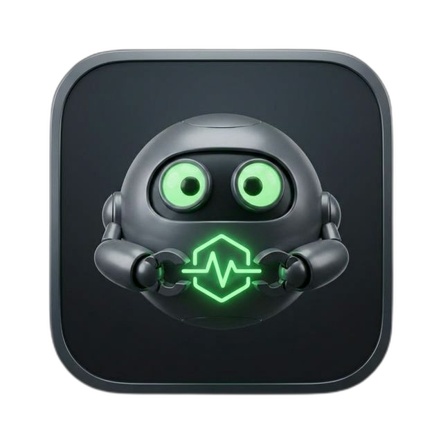

<p align="center">
  
</p>

# PulseGrab — Universal Download Manager for Emby, Plex & Jellyfin

[](https://github.com/h3x4d3x4/PulseGrab/releases)
[](LICENSE)
[](https://greasyfork.org/en/scripts/573086-pulsegrab-universal-download-manager)
[](https://github.com/h3x4d3x4/PulseGrab)

> **A powerful browser userscript that turns any Emby, Plex, or Jellyfin media server into a direct download hub.** Grab movies, TV shows, music, photos, and entire libraries — straight from the browser with zero extra software. Supports built-in concurrent downloads, JDownloader integration, wget/curl script generation, QR codes, and 10+ export formats.

**If PulseGrab saves you time, consider supporting development:**

[](https://ko-fi.com/hexadexa)
[](https://github.com/sponsors/h3x4d3x4)

## Current Version: **v1.0.8**

**Latest Release**: [PulseGrab.user.js](https://github.com/h3x4d3x4/PulseGrab/raw/main/releases/PulseGrab.user.js)

---

## Changelog

### v1.0.8
* **Pass `userId` in show/season ID async fallback** — v1.0.7's new resolver called `getItemInfo` without a `userId`, so it hit the unscoped `/Items/{id}` endpoint which 404s on Emby Connect / non-admin user contexts. Now passes `userId` from `getServerAndToken()` so the fallback uses `/Users/{userId}/Items/{id}`, matching the rest of the codebase.

### v1.0.7
* **Fixed show/season ID detection on `app.emby.media`** — `parseIdsFromPage()` extracted the show ID from a `div.itemBackdrop` element's CSS `style` attribute. On the Emby cloud client (and other layouts that don't render the backdrop with the parent show's image URL), no match → "Could not detect show/season IDs" error when clicking **Get Links** on a TV show page. Added an async fallback that uses the URL `id=` + `Items` API to resolve `showId` / `seasonId` from `Type` (`Series` / `Season` / `Episode`) — works regardless of DOM rendering.

### v1.0.6
* **Fixed About-dialog version display** — `SCRIPT_VERSION` was hardcoded to `'1.0.2'` and never bumped on releases, so the About dialog and console log message kept showing 1.0.2 regardless of what was actually installed. Now derived dynamically from `GM_info.script.version` (the `@version` metadata header), so the metadata header is the single source of truth.

### v1.0.5
* **Stable update URL** — `@updateURL` and `@downloadURL` now point to a single stable filename `PulseGrab.user.js` instead of a per-version URL. Previous releases hardcoded their own filename, so each version bump silently broke auto-update for older installs (404). With v1.0.5 onward, version bumps no longer affect the update path.
* **One-click in-app updates** — clicking **Install Update** now navigates directly to the userscript URL, which Tampermonkey/Violentmonkey intercept with their native install prompt. No more downloading a `.js` to your downloads folder and opening it manually.
* **Cleaner `@connect` list** — removed `release-assets.githubusercontent.com` and `objects.githubusercontent.com` since the in-app updater no longer hits the GitHub release-asset CDN.

### v1.0.4
* **In-app updater fix** — added `@connect release-assets.githubusercontent.com` and `@connect objects.githubusercontent.com`. The GitHub Releases asset API redirects to those hosts, and userscript managers were blocking the redirect, so clicking **Install Update** failed with a "Refused to connect / not whitelisted URL" error.

### v1.0.3
* **JDownloader fix** — added `@connect localhost` and `@connect 127.0.0.1` to the userscript header. Userscript managers were blocking GM_xmlhttpRequest calls to `http://localhost:9666/flashgot`, breaking the "Send to JDownloader" action.

### v1.0.2
* **In-app update checker** — automatically checks GitHub Releases for new versions on each load with one-click install. Configurable check interval and manual "Check Now" button in Settings.
* **Music library support for Plex** — full artist-to-album-to-track expansion now works for Plex music libraries. Previously, music libraries returned "No downloadable media files found" because `MusicArtist` items were not expanded into their tracks.
* **Music library support for Emby/Jellyfin** — recursive artist and album expansion with proper `IncludeItemTypes=Audio` filtering.
* **Settings UI** — new "Updates" section with GitHub PAT input, auto-check toggle, check interval, and manual "Check Now" button.
* **About modal** — now shows whether PulseGrab is up to date or if a newer version is available.
* **Version display fix** — the console loaded message now dynamically uses `SCRIPT_VERSION` instead of a hardcoded string.

### v1.0.1
* Added Plex home page server discovery — "Get Links" now works on `app.plex.tv` home page by discovering servers via the `plex.tv/api/v2/resources` API with a server picker dialog for multi-server accounts.
* Fixed `detectPageTypePlex()` returning `unknown` for empty/missing hash on `app.plex.tv`.
* Fixed Plex music library type mapping (`artist` is now correctly mapped to `music`).
* Fixed double `processFunction()` execution that was doubling all API calls.
* Fixed `originalItems` undefined `ReferenceError` in bypass button handler.
* Fixed `processQueue()` undefined — corrected to `startNextDownload()`.
* Fixed `gmFetch().json()` crash on non-JSON responses with try/catch wrapper.
* Fixed `parallelFetch` deadlock on rejected tasks by using `.finally()` for cleanup.
* Fixed duplicate `searchInput` event listener in Download Manager.
* Fixed null download URL crash for Plex containers without `_plexPartKey`.
* Fixed Plex photo `MediaType` (was `Video`, now correctly `Photo`).
* Added missing `@grant GM_deleteValue` and `@grant GM_listValues` declarations.
* Added missing `episodes` argument to `showConfirmDialog` in Plex `processShow` path.
* Added `return null` guard in `EXTRACT_SUBTITLES` for Plex subs without `_plexStreamKey`.
* Renamed `_embyGrabLargeFolderConfirmed` to `_pulseGrabLargeFolderConfirmed`.
* Fixed `fetchAllLibraries()` Emby branch to use `apiPrefix()` consistently.

### v1.0.0
* Initial PulseGrab release — universal rewrite of EmbyGrab with full Plex and Jellyfin support.
* Server auto-detection (Emby, Plex, Jellyfin) with adaptive theming.
* Plex API layer: auth token interception via fetch/XHR/WebSocket hooks, item normalization to Emby's canonical shape, download URL construction via `/library/parts/` endpoints.
* Jellyfin support via dynamic API prefix (drops `/emby/` path segment).
* Storage migration from EmbyGrab (`emby_dl_*`) to PulseGrab (`pulse_dl_*`) keys.
* Server-adaptive accent themes: Emby Green, Plex Amber, Jellyfin Purple.

---

## Quick Start

1. **Install a Userscript Manager** — [Tampermonkey](https://www.tampermonkey.net/), [Violentmonkey](https://violentmonkey.github.io/), or Greasemonkey in Chrome, Edge, Firefox, or Safari.
2. **Add the script** — install from [Greasy Fork](https://greasyfork.org/en/scripts/573086-pulsegrab-universal-download-manager) (recommended) or download from [GitHub Releases](https://github.com/h3x4d3x4/PulseGrab/releases/latest).
3. **Navigate** to your Emby, Plex, or Jellyfin server in the browser.
4. **Click** the floating **"Get Links"** button that appears on any media page.

**Detailed Setup**: [Quick Start Guide](guides/PULSEGRAB-QUICK-START.md)

---

## Supported Servers

| Server | Status | Auth Method |
|--------|--------|-------------|
| **Emby** | Full support | API key from page context |
| **Plex** | Full support | Token captured via fetch/XHR/WebSocket interception |
| **Jellyfin** | Full support | API key from page context (no `/emby/` prefix) |

PulseGrab auto-detects which server you're using and adapts its API calls, URL construction, theme colors, and UI accordingly.

---

## Key Features

### Download Methods
| Method | Description |
|--------|-------------|
| **Built-in Manager** | Concurrent in-browser downloads with pause, resume, retry, and progress tracking |
| **JDownloader** | One-click send to a running JD2 instance via local API socket |
| **wget / curl Scripts** | Generate ready-to-run terminal scripts (`.bat`, `.command`, `.sh`) with correct filenames |
| **aria2** | Export as aria2 input file for accelerated multi-connection downloads |
| **Clipboard** | Copy all URLs in your chosen format |
| **QR Code** | Scan links on mobile for cross-device transfers |
| **Email** | Send a batch of download links via `mailto:` |

### Export Formats
Plain URLs, M3U8 playlist, JSON, HTML, CSV, XML, wget script, curl script, aria2 input, JDownloader package

### Content Support
- **Movies** — single files with year, resolution, and codec metadata
- **TV Shows** — entire series, individual seasons, or single episodes with S01E01 naming
- **Music** — full artist-to-album-to-track expansion for all three server types
- **Collections & BoxSets** — recursive expansion including nested series/seasons
- **Photos** — Plex photo libraries with correct MediaType handling
- **Libraries** — download an entire library with progress tracking
- **Server root** — download everything on the server (with large-batch confirmation dialog)

### Download Manager
The built-in browser downloader provides a complete download experience:

- **Stats View** — real-time stat cards (Total / Done / Active / Queued / Failed), segmented color progress bar with legend, per-folder breakdown table, and a live "Currently Downloading" panel with per-item speed and ETA
- **Per-item Controls** — context-aware buttons: Start, Pause, Stop, Retry, Dismiss, Re-download
- **Concurrent Downloads** — configurable 1–5 parallel streams
- **Search & Filter** — search within results, filter by status tab
- **Keyboard Shortcuts** — `Ctrl+D` open manager, `Ctrl+H` toggle history, `Ctrl+S` open settings, `Esc` close panels
- **Overall ETA** — live estimate shown in the status bar during downloads

### Smart Features
- **Bypass Mode** — Strict DirectPlay bypass for servers that restrict direct downloads
- **Download History** — local tracking with export; optionally skip already-downloaded files
- **Selective Download** — checkbox any item or group, then download only the selected items
- **Smart Grouping** — TV Shows grouped by season, Music by artist/album, Movies together
- **Background Prefetch** — pre-fetches item metadata before you click "Get Links"
- **Request Caching** — avoids redundant API calls within a session
- **Parallel Fetching** — concurrent season/album fetching for faster scanning of large libraries
- **In-app Updates** — automatic update checking via GitHub Releases API with one-click install

### Appearance
- **Dark Mode** — full dark/light theme toggle across all panels and dialogs
- **Server-adaptive Themes** — auto-detects your server type and applies matching accent colors
- **Theme Options** — Emby Green, Plex Amber, Jellyfin Purple, Ocean Blue, or Auto
- **Compact Mode** — condensed UI layout for smaller screens

---

## Settings Reference

| Section | Key Options |
|---------|-------------|
| **General Basics** | Button position, default output format, batch size, concurrent downloads (1–5), auto-confirm, rate limiting, debug logging |
| **Appearance** | Accent theme (Auto / Emby / Plex / Jellyfin / Ocean), dark mode, compact view |
| **Filters & History** | Download history tracking, skip-downloaded, exclude extras, quality preset floor (Any / 720p / 1080p / 4K+), file-size min/max thresholds |
| **JDownloader** | Enable/disable local API socket, auto-detect, custom port |
| **Naming Templates** | Customizable episode and movie filename macros with substitution tokens |
| **Subtitles** | External subtitle downloads, language selection grid |
| **Updates** | Auto-check toggle, check interval, manual check button |

---

## In-App Updates

PulseGrab automatically checks for new versions via the GitHub Releases API:

1. Updates are checked on every script load (respecting a configurable interval, default: 24 hours)
2. When a new version is detected, a notification banner appears with a changelog preview and an **Install Update** button
3. Clicking **Install Update** downloads the latest release and triggers Tampermonkey's install prompt
4. You can also manually check via **Settings → Updates → Check Now**
5. Auto-checking can be disabled in **Settings → Updates**

---

## Project Structure

```
PulseGrab/
├── README.md                         # This file
├── assets/
│   └── pulsegrab_logo.png            # Project logo
├── releases/
│   ├── PulseGrab.user.js             # Stable URL — always serves the latest release
│   ├── PulseGrab v1.0.4.js           # Per-version archive (kept for legacy install URLs)
│   └── EmbyGrab v1.0.1.js            # Legacy Emby-only version
├── guides/
│   ├── PULSEGRAB-QUICK-START.md      # Installation & first-use guide
│   ├── JDOWNLOADER-SETUP-GUIDE.md    # JDownloader 2 integration setup
│   ├── COLLECTION-404-FIX.md         # Troubleshooting collection errors
│   └── WGET-CURL-DOWNLOAD-GUIDE.md   # Terminal download scripts guide
└── .gitignore
```

---

## Common Use Cases

### Download an Entire TV Series
1. Navigate to the TV show page on your Emby, Plex, or Jellyfin server
2. Click **Get Links** — PulseGrab expands all seasons and episodes automatically
3. In the Results dialog, click **Download Manager**
4. Press **Start** — episodes download concurrently (up to 5 parallel streams)

### Download a Music Library
1. Navigate to your Music library page
2. Click **Get Links** — PulseGrab expands all artists → albums → tracks
3. Choose your preferred format (direct download, M3U8 playlist, wget script, etc.)

### Selective Episode Download
1. Open the Download Manager from the Results dialog
2. Check only the items you want
3. Click **Selected** in the toolbar — only checked items download

### Send to JDownloader
1. Enable JDownloader in **Settings → JDownloader**
2. Ensure JDownloader 2 is running with the RemoteAPI enabled on port 9666
3. Click **Send to JDownloader** in the Results dialog — files appear with correct folder structure

### Download from Plex Home Page
1. Navigate to `app.plex.tv` (the main Plex home page)
2. Click **Get Links** — PulseGrab discovers your servers via the Plex API
3. If you have multiple servers, pick one from the server picker dialog
4. All libraries are scanned and expanded into downloadable items

---

## Contributing

Found a bug or want a feature?

1. Test with the latest version from [Releases](../../releases)
2. Reproduce with **Debug Logging** enabled (Settings → General Basics)
3. Open an issue with console logs and steps to reproduce

---

## Disclaimer

PulseGrab is a tool for managing downloads from media servers you have authorized access to. The developers are **not responsible** for any misuse. Users are solely responsible for ensuring they have the legal right to download any content. Use responsibly and in accordance with your server's terms of service.

---

## License

[MIT License](LICENSE) — free to use, modify, and distribute.

---

**Enjoy seamless media server downloads with PulseGrab!**
